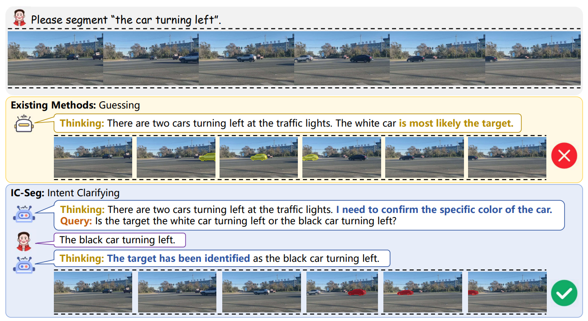
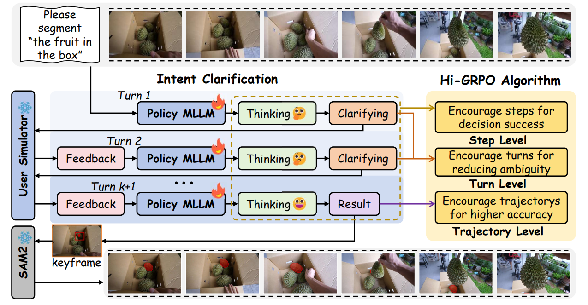

<div align="center">
<br>
<h2><i>Don't Guess, Just Ask</i>: Resolving Ambiguity in Referring Segmentation via Multi-turn Clarification</h2>

Yuting Yang<sup>†</sup> &nbsp;
Haichao Jiang<sup>†</sup> &nbsp;
[Tianming Liang](https://tmliang.github.io/) &nbsp;
[Quan Zhang](https://qzhang74.top/) &nbsp;
[Jian-Fang Hu](https://isee-ai.cn/~hujianfang/)* &nbsp;

Sun Yat-sen University &nbsp;

[](https://arxiv.org/abs/2605.17531)
[](https://opensource.org/licenses/Apache-2.0)

</div>

## 🌟 Highlights

When the user query lacks complete
details to uniquely distinguish the intended target, existing methods tend to arbitrarily guess user preferences, while our **IC-Seg** proactively interacts with the user to clarify their real intention.


## 🎯 Framework

**IC-Seg** resolves ambiguities via multi-turn dialogues with an MLLM-based User Simulator. Our **Hi-GRPO** algorithm empowers the agent through a hierarchical reward chain: supervising final localization accuracy at the **trajectory** level, inquiry quality at the **turn** level, and fine-grained reasoning **steps** using expert-diagnosed signals.

## 🙏 Acknowledgements
Our work is built upon [Seg-ReSearch](https://github.com/iSEE-Laboratory/Seg-ReSearch/tree/main) and [SDPO](https://github.com/lasgroup/SDPO). We sincerely appreciate these excellent works.

## 📝 Citation
If you find our work helpful for your research, please consider citing our paper.
```bibtex
@misc{yang2026textitdontguessjustask,
      title={$\textit{Don't Guess, Just Ask}$: Resolving Ambiguity in Referring Segmentation via Multi-turn Clarification}, 
      author={Yuting Yang and Haichao Jiang and Tianming Liang and Quan Zhang and Jian-Fang Hu},
      year={2026},
      eprint={2605.17531},
      archivePrefix={arXiv},
      primaryClass={cs.CV},
      url={https://arxiv.org/abs/2605.17531}, 
}
